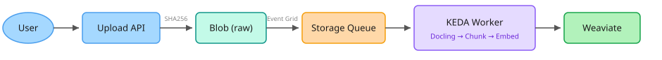
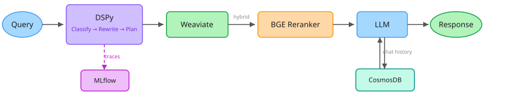

# Project Astryx

Multimodal RAG system on Azure. Documents go in, cited answers come out.

## Architecture

### Ingestion

- File uploaded via FastAPI, SHA256-deduped into Azure Blob
- Event Grid triggers Storage Queue message
- KEDA-scaled ACA worker picks it up
- Adaptive 2-pass Docling: fast pass on all pages, expensive OCR only on pages with tables/images
- Semantic chunking by headers, image-to-text association via OCR caption overlap
- Batch embed via Azure embed-v-4-0 (text 96/batch, images 20/batch)
- Multi-tenant Weaviate ingest with bidirectional TextChunk/ImageChunk cross-refs
- Blob tags track state: `processing` / `embedded` / `embedding_failed`

### Inference

- Query classified into RAG / MATH / TOOL / NO_CONTEXT
- Rewritten for retrieval, RetrievalPlanner outputs hybrid alpha + k
- Custom Weaviate retrieval (WeaviateRM doesn't support BYOV + multi-tenancy)
- BGE-reranker-v2-m3 via Replicate
- LLM generates cited answer, SelfCritic retries if below threshold
- CosmosDB for conversation memory, MLflow for tracing

## Stack

| Layer | What |
|---|---|
| Processing | Docling (adaptive 2-pass PDF), MarkItDown (rest) |
| Chunking | Custom semantic, header-aware, OCR-based image association |
| Embedding | Azure AI embed-v-4-0, 1536d, BYOV via LiteLLM |
| Vector DB | Weaviate Cloud, multi-tenant, HNSW dynamic, bidirectional cross-refs |
| Reranker | BGE-reranker-v2-m3 via Replicate |
| LLM | Azure OpenAI via LiteLLM |
| Inference | DSPy, 13 signatures, custom reranker wrapper |
| Chat memory | CosmosDB, per-user partitioned |
| Observability | MLflow on Azure ML Studio |
| Infra | Azure Container Apps (KEDA), Blob, Queue, Event Grid |

## Design Decisions

- **Adaptive 2-pass Docling** -- fast pass first, expensive OCR only on pages that need it. 86s to 5s on mixed PDFs.
- **BYOV over native vectorizer** -- embeddings computed via LiteLLM, passed to Weaviate manually. Full control over model swaps.
- **Single-stage reranking** -- ColBERT dropped, added latency without improving relevance at our scale. BGE alone at 0.0015s/call via Replicate.
- **Deterministic IDs** -- uuid5 from node_id. Re-ingesting same file produces same objects. Idempotent.
- **Image URLs, not base64** -- images uploaded to Blob, only URL stored in ImageChunk. Avoids index bloat.
- **Bidirectional cross-refs** -- TextChunk.hasImages / ImageChunk.belongsToText, wired in second pass. Preserved across backup/restore.
- **All models via LiteLLM** -- one SDK, swap any provider by changing a string.
